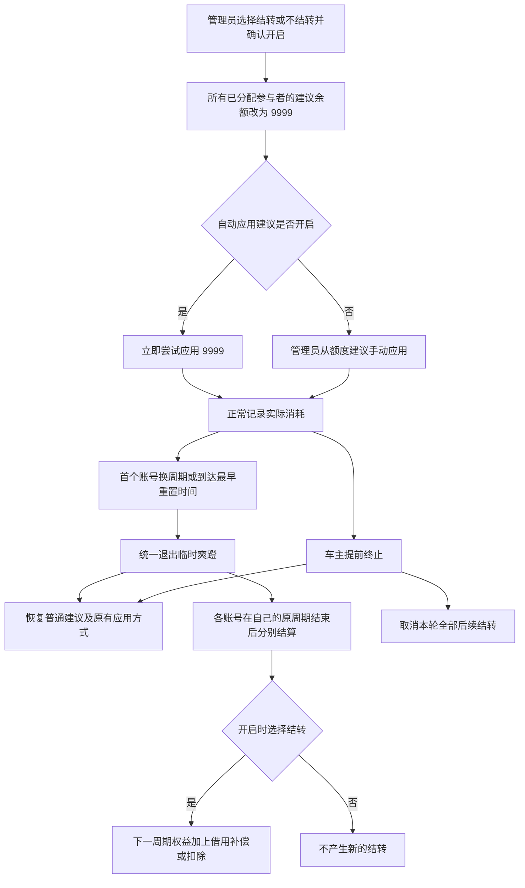
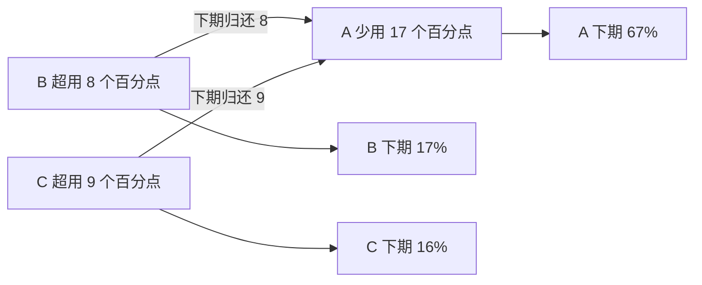

# 临时爽蹬模式

临时爽蹬把参与者的建议余额暂时统一设为 **9999 美元**，继续记录真实消费，由车主在开启前选择**结转或不结转**。它不会增加订阅容量，也不会永久修改合同分配比例。

应用内入口：**额度总览 → 当前额度建议下方 → 临时爽蹬**。教程入口：**使用教程 → 日常使用 → 临时爽蹬**。全流程漫画以同样的 33%/33%/34% 消耗对照两种模式：结转时下期 67%/17%/16%，不结转时仍为 50%/25%/25%。五个交互例子支持切换模式；提醒小漫画专门解释不结转模式为何必须通知所有车友。

## 开启与退出



1. 所有启用的 Sub2API 账号需有当前周期的新鲜有效观测和完整参与者归属。
2. 管理员点击“开启结转爽蹬”或“开启不结转爽蹬”两个独立按钮之一，再确认开启，没有预选模式。本轮不能切换；**不结转必须告知所有车友并勾选确认，结转无需逐一通知**。多账号额外提示共享余额无法按账号隔离。
3. 已开启自动应用时，系统立即尝试写入余额，并显示成功、失败人数；未开启时只改变建议，需要手动应用。
4. 模式到期后，**不再统一建议 9999**。自动应用仍按原开关运行；未开启自动应用时，需要手动应用新建议，收回上游高余额。
5. 同一时间只能有一轮生效或等待原周期处理。提前终止后可以在同一上游周期重新开启，旧轮次不再结算；刷新、重启不会丢失模式或结算记录。

> 9999 是钱包余额，不是 9999% 权益。上游限速、模型权限和套餐总量限制仍然有效；放开余额后，个别人可能迅速耗尽全组订阅额度。

### 不结转必须通知，结转无需逐一通知

不结转模式多用不追账、少用不补偿。其他车友提前耗尽额度并用重置卡后，原本打算晚几天使用的人可能既改变了使用安排，又得不到下期权益补偿，因此开启前必须通知所有车友。教程保留三格漫画：“我还没上车，我的下周一先被蹬走了？！”

结转模式不强制逐一通知：被借用的权益会在后续周期补偿，可帮助暂时用不上的车友安排后续使用。结转的是借用权益，不是储存上游流量；未被借用的闲置额度不保留。两种模式均不会自动用重置卡或充值，提前用卡仍建议沟通时间安排。

### 提前终止爽蹬

车主点击红色“提前终止爽蹬”，在“你确定提前终止爽蹬吗？”模态框确认后：

- 立即恢复普通额度建议，不再建议 9999。
- 停止本轮提醒、加速采样，取消该轮所有待处理周期及后续结转；已超用不追账，少用不补偿。
- 多账号自然退出后，只要本轮还有原周期待处理，也可以提前终止并取消本轮剩余结转。
- 自动应用按原开关尝试写回普通余额；未开启或写入失败时需手动应用、重试。
- 操作不可撤销，但结束后可以重新选择模式并开启，无需等待上游换周期；不会删除消费事实或修改合同。

### 加速采样与状态提示

- 爽蹬原周期内，本地采样间隔减半；最后观测已用 ≥ 90%，或距离原定重置 ≤ 30 分钟时，每分钟采样。
- 加速期间不再被普通消费进度阈值跳过额度读取；仍遵循账号配置的主动／被动查询方式。
- 每个账号确认进入新周期后取消加速。首个账号导致全局退出时，其他原周期账号继续加速直至各自换周期。
- 不修改用户保存的常规间隔，暂停监控时不执行加速；轮询进程在等待中重新检查策略。
- 管理界面以橙色边框、全局状态条展示模式、采样间隔及“本轮爽蹬剩余时间”，并注明任一账号提前重置会提前结束。退出后撤销氛围，未完成的周期保留待结算提示。模式开启不代表上游余额已经成功应用。

### 本轮用满邮件提醒

- 默认关闭。开启爽蹬后，在卡片切换“用满提醒”，仅对本轮有效，重新开一轮不会自动沿用。
- 需要配置管理员接收邮箱及 SMTP／Resend 发件服务；SMTP 需要认证时，还需配置密码。建议先发送测试邮件。服务可达性或凭据有效性以实际投递结果为准。
- 本轮原周期账号最新有效观测 **已用 ≥ 95%** 时开始提醒；每个账号每 **30 分钟最多一次**，独立于普通通知的冷却时长。
- 95%～不足 100% 的邮件明确写“接近用满”，不冒充已经耗尽；邮件包含账号、用量、观测时间、原定重置时间和用卡前告知车友的提醒。
- 关闭开关停止本轮所有提醒；各账号换周期后停止自己的提醒，其他原周期账号继续检查。监控暂停时不自动发送。
- 投递及失败保留在通知记录。失败尝试也进入 30 分钟冷却，避免持续失败时频繁重试；不承诺未经观测的精确 95% 瞬间通知。
- 公开演示只保存模拟通知记录，不发送真实邮件。

### 管理员手动调整当前结转

在“额度分配”页面，只有当前周期存在非零结转时，合同份额右侧才显示独立的“结转权益”输入框。正数补偿、负数扣除；输入 0 清除，保存后零结转输入框隐藏。可输入 −100 至 100，最多 5 位小数。

例如合同 50%、原结转 +17 个百分点，本期权益为 67%；把结转设为 10 后，本期变为 60%，合同仍为 50%。同池多个账号分别显示各自的结转，不合并百分点。

点击“保存分配”后更新当前周期的余额建议；不会直接写上游余额，仍需自动或手动应用。管理员修改是独立覆盖值，不会自动调整其他人，因此不保证整体零和，请自行协调。原始结转、历史结算和实际消耗不改写；每次修改保留管理员、时间及前后值，可在爽蹬卡片周期详情查看。

保存与合同分配在同一事务及账号租约内完成。按周期 ID、绑定用户和编辑版本校验；周期过期或已经切换、绑定变化、并发修改等情况拒绝整个保存，避免覆盖新周期或部分保存。

## 结算规则

以**百分点**记账，不把不同模型的美元成本直接视为权益比例：

**结转模式**在确认进入下一周期时，按以下公式处理借用，不以账号用量或是否耗尽作为门槛。**不结转模式**不产生新调整；**手动提前终止**取消该轮全部后续结转。账号剩余和观测时间只作为证据展示，不决定是否结转。

```text
本期可用权益 = 固定合同权益 + 上期结转调整
未用份额 = max(本期可用权益 − 本期实际归属, 0)
超用份额 = max(本期实际归属 − 本期可用权益, 0)
实际借用总额 = min(总未用份额, 总超用份额)
```

- 借用总额按各人的**未用份额比例**补偿给让出权益的人。
- 同一总额按各人的**超用份额比例**从超用者下一期权益扣除。
- 补偿与扣除合计为零；没有被借用的闲置份额到期作废，不凭空增加下一期权益。
- 未分配或无法归属的剩余容量不虚构成某人的借出份额。
- 内部以 5 位小数的百分点结算，界面显示 2 位；舍入余数确定性分配，保证账本加减严格相等。
- 合同份额和真实消耗记录保持不变，调整作为独立的周期记录参与普通余额建议计算。

## 示例一：结转模式，整轮额度用满

合同为 A 50%、B 25%、C 25%，实际使用 33%、33%、34%。



| 参与者 | 合同权益 | 实际使用 | 下期调整 | 下期可用权益 |
| --- | ---: | ---: | ---: | ---: |
| A | 50% | 33% | +17 个百分点 | 67% |
| B | 25% | 33% | −8 个百分点 | 17% |
| C | 25% | 34% | −9 个百分点 | 16% |

## 示例二：B 超用 5 个百分点，A、C 都剩很多

| 参与者 | 合同权益 | 实际使用 | 未用份额／超用 |
| --- | ---: | ---: | ---: |
| A | 50% | 20% | 未用 30 个百分点 |
| B | 25% | 30% | 超用 5 个百分点 |
| C | 25% | 5% | 未用 20 个百分点 |

账号用了 55%，仍按车主所选模式处理。结转模式下，B 借用的 5 个百分点按 A/C 未用份额 30:20 分摊，下一周期为 **A 53%、B 20%、C 27%**。

不结转模式下，下一周期仍为 **A 50%、B 25%、C 25%**。未被借用的闲置容量不累计。

## 示例三：没有人超用

- A 用 50%、B 用 15%、C 用 10%：A 只是用满自己的份额，并未借用他人权益。
- A 用 30%、B 用 20%、C 用 20%：所有人都没用满。

两种情况在没有旧结转的前提下，下一期均保持 **50% / 25% / 25%**。用得比别人多不等于欠账；结转模式下，只有超出本期可用权益、且实际借用了其他人的权益才产生调整。

## 再下个周期怎么办

固定合同始终是 50% / 25% / 25%，不是永久改成 67% / 17% / 16%。第二期按**调整后的本期权益**结算：

| 第二期实际使用 | 第二期末新的借用调整 | 第三期可用权益 |
| --- | --- | --- |
| 67% / 17% / 16% | 0 / 0 / 0 | 50% / 25% / 25% |
| 50% / 25% / 25% | +17 / −8 / −9 | 67% / 17% / 16% |
| 60% / 20% / 20% | +7 / −3 / −4 | 57% / 22% / 21% |

若没有人超出第二期调整后的权益，就不产生新的借用；未使用且未被借用的额度到期作废，不不断积累为无限权益。

## 多账号与观测边界

- **全局开启、首个换周期退出**。同一个参与者在 Sub2API 只有一个全局钱包，因此不能假装 9999 只影响首页选中的账号。
- 覆盖所有启用的 Sub2API 账号及其已分配参与者，CPA 不参与。
- 账号重置时间不同：首个账号确认换周期时统一退出，较晚账号在自己的原周期结束时再结算。它们不会让已经进入新周期的账号继续无限使用。
- 每个账号独立按自己的周期和百分点结算，按现有容量、实际扣费换算后汇入全局余额建议；不同账号百分点不直接相加结算。
- 本期合同与参与者绑定在开启时冻结；结算覆盖该官方周期已保留的有效归属数据，不仅计算开启后的消费。
- 价格时期变化和人工测算起点不等于订阅换周期；同一官方周期的多个测算段合并计入消耗，同一段只取最后有效累计值，避免重复记账。
- 结算依据是旧周期保留的最后有效观测，卡片显示证据时间；不伪造未采样尾部消费。
- 缺失参与者证据、有未结清权益的参与者被移除或换绑、跨过多个周期等情况，保留待结算错误，不静默丢失借用账。
- 暂停后台监控后，模式到期仍停止建议 9999，但自动采样、上游余额回收和结算不会凭空完成；需恢复监控或手动采样、应用并核对上游余额。

## 实现与验证

- `GET /api/dashboard/temporary-burst`：管理员读取全局状态、各账号周期与结算依据，不修改余额。
- `POST /api/dashboard/temporary-burst`：`{"confirm": true, "carryover_enabled": true}` 开启结转模式；`{"confirm": true, "carryover_enabled": false, "riders_notified": true}` 开启不结转模式。模式必须是布尔值；不结转必须明确确认已通知所有车友。
- `DELETE /api/dashboard/temporary-burst`：`{"confirm": true, "session_id": 1}` 提前终止当前轮次，恢复普通建议、取消后续结转并按自动应用开关尝试写回。权限、会话 ID 和确认均在服务端校验，拒绝过期操作。
- `PATCH /api/dashboard/temporary-burst`，请求 `{"session_id": 1, "reminder_enabled": true}`：切换当前轮次提醒；要求管理员权限，启用前检查邮件配置。关闭不要求邮件仍配置完整。
- `GET /api/quota-allocation` 返回当前可见参与者的 `carry_adjustments`；`PUT` 可同时提交修改项的周期、账号、参与者、绑定用户、版本和 `adjustment_percent`。不提交的结转保持不变；清零不会清除其他人的权益。
- 迁移 `0057_temporary_burst` 新建模式与周期账本，不联网，不自动开启。
- 迁移 `0059_burst_settlement_context` 保存结算原因与额度观测证据。
- 迁移 `0060_burst_exhaustion_reminder` 保存本轮提醒开关及新的通知类型，不自动启用或发送邮件。
- 迁移 `0061_burst_carry_edits` 为周期添加独立的管理员编辑记录，不重算既有结算。
- 迁移 `0062_burst_modes` 添加模式与提前终止时间字段，仅改变表结构，不包含历史数据兼容分支。
- 手动与自动调额复用既有带租约、幂等对账的余额操作链路。
- `backend/monitor/tests/test_temporary_burst.py` 验证模式决定结转、通知权限、守恒、重复结算、多账号、提前终止取消待结转、普通建议恢复及自动／手动应用。
- `scripts/temporary_burst_browser_smoke.py` 使用全新合成数据库、真实 Django/Vue、本机模拟钱包与 SMTP 接收器验证。覆盖提醒开关持久化、真实 SMTP 传输与半小时节流，禁止连接真实业务环境或真实邮箱。
