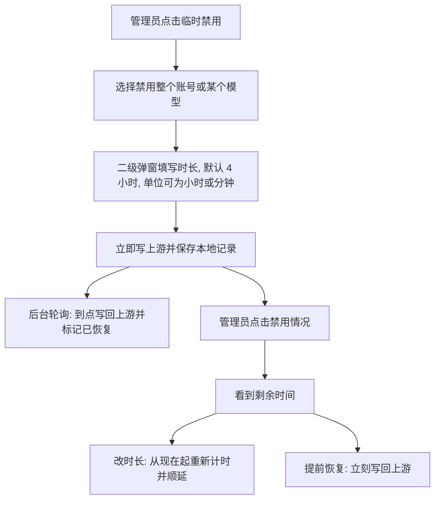

# 临时禁用

临时禁用让管理员在**不改动合同份额、不产生观测、不影响额度测算**的前提下，把某个上游账号暂时从调度中拿掉。到期后由后台轮询自动写回上游，全过程以本地记录为日志。

应用内入口：**账号状态 → 账号名称右侧 → 临时禁用**。禁用情况显示在同一个账号卡片的**运行状态**区域。

## 两种范围

| 范围 | 上游动作 | 恢复动作 |
| --- | --- | --- |
| 禁用整个账号 | `POST /api/v1/admin/accounts/:id/schedulable`，`{"schedulable": false}` | 写回禁用前的 `schedulable` |
| 禁用某一个模型 | 读取账号当前可服务模型，去掉该模型后整体写回 `credentials.model_mapping` | 写回禁用前的 `model_mapping`；原本没有白名单则删除该键 |

禁用模型时，可禁用集合由 Sub2API 决定：

- 账号已配置 `model_mapping` 白名单：白名单的键就是全部可服务模型，禁用即删除对应键，其他别名映射保持原样。
- 账号未配置白名单（上游目录全放行）：先从 Sub2API 读取该账号的模型目录，再写入“目录去掉该模型”的白名单。

> 因为整体回写 `credentials` 会把非敏感子键按请求内容决定，客户端必须先读回脱敏凭据再写入，只覆盖 `model_mapping`。敏感子键（token、api_key 等）未随请求提供，由 Sub2API 自行保留；`base_url` 等非敏感配置不会被清空。

## 时长与恢复时刻

- 时长以分钟为单位保存，范围 1 分钟到 30 天。
- “调整”不是修改原恢复时刻而是**从现在重新计时**：原设 4 小时、已过 2 小时后再填 4 小时，实际顺延 2 小时。
- 到点恢复由 `runmonitor` 在空闲等待期间执行（每 5 秒检查一次），不依赖管理页是否打开。
- 自动恢复失败会记录错误，并在 5 分钟后重试；失败不影响其他记录，也不需要人工干预即可继续重试。

## 权限

- **管理员**：可以发起禁用、调整恢复时刻、提前恢复；账号状态页显示禁用情况并提供操作入口。
- **系统用户（拥有账号状态页权限）**：只能看到禁用情况（含剩余时间），看不到也点不动“临时禁用”，操作者姓名不下发。
- 所有写接口都要求管理员身份，系统用户直接请求会得到 403；上游模型列表接口同样仅限管理员。

## 记录与不变量

每条 `AccountTemporaryDisable` 就是它自己的审计日志：范围、模型、操作者、开始时间、恢复时刻、恢复来源（手动/自动）和未确认的错误。

1. 同一账号同时最多一条账号级和一条模型级有效记录。禁用模型时若已有记录，必须先调整或提前恢复，避免两个恢复目标互相覆盖。
2. 上游写入失败时记录保留为“未确认”并附上错误，而不是静默丢弃；管理员可再次确认（调整时长会重试写入）或提前恢复。
3. 禁用不修改观测、账本、建议或参与者权益，也不产生新的采样事实；账号重新可用后，测算按正常采样继续。
4. 账号级恢复写回的是**禁用前**的 `schedulable`。原本就不可调度的账号不会被临时禁用意外打开调度。
5. 临时禁用只支持 Sub2API 上游账号；CPA 账号不提供该入口。

## 排查

- **点确认后报 409**：账号正被采集或历史维护任务占用（租约冲突），稍后重试即可。
- **禁用情况旁出现红色错误**：上游写入未确认。检查 Sub2API 可达性后再次调整时长（会重试写入）或提前恢复。
- **自动恢复待重试**：自动恢复失败并进入 5 分钟退避；到点后自动再次尝试。
